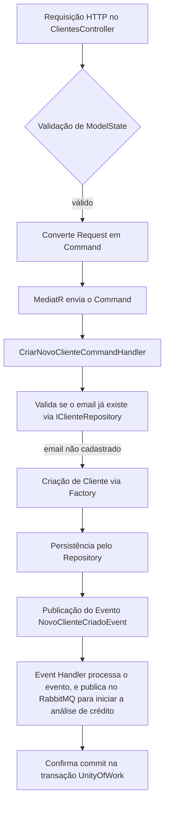

# PB.Clientes

Microsserviço de criação do cliente, é o inicio do fluxo de análise de crédito e emissão de cartões de crédito.

Este repositório implementa uma arquitetura baseada em DDD e CQRS para uma API REST, utilizando padrões como Factory, Repository, Command Handler com MediatR, além de integração com MassTransit e RabbitMQ para mensageria.

## Visão Geral

O sistema é dividido em camadas:
- **API** ([src/api/PB.Clientes.Api](src/api/PB.Clientes.Api)): Expõe os endpoints HTTP e gerencia as requisições REST.

- **Application** ([src/application/PB.Clientes.Application](src/application/PB.Clientes.Application)): Responsável pelos command handlers, event handlers e a orquestração dos processos de negócio, utilizando MediatR para a comunicação entre componentes.

- **Domain** ([src/domain/PB.Clientes.Domain](src/domain/PB.Clientes.Domain)): Contém a lógica de negócio, entidades, fábricas (Factory) e eventos de domínio.

- **Infra** ([src/infra/PB.Clientes.Infra.Data](src/infra/PB.Clientes.Infra.Data)): Responsável pela persistência de dados e implementação dos repositórios e a implementação da UoW (UnityOfWork).

- **Testes:** ([test/PB.Clientes.UnityTests](test/PB.Clientes.UnityTests))  
  Contém testes unitários utilizando frameworks como xUnit.

## Estrutura do Projeto

```plaintext
PB.Clientes.sln
├── .github/
├── dependencies
│   ├── PB.Commons.Api.dll
│   └── PB.Commons.Infra.Kernel.dll
├── src
│   ├── api
│   │   ├── PB.Clientes.Api
│   │   │   ├── Controllers
│   │   │   │   └── ClientesController.cs
│   │   │   └── Program.cs
│   │   └── PB.Clientes.ApiModels
│   │       └── Clientes
│   │           └── CriarNovoCliente.cs
│   ├── application
│   │   └── PB.Clientes.Application
│   │       ├── CommandHandlers
│   │       │   └── Clientes
│   │       │       └── CriarNovoClienteCommandHandler.cs
│   │       └── EventHandler
│   │           └── NovoClienteCriadoEventHandler.cs
│   ├── domain
│   │   └── PB.Clientes.Domain
│   │       └── Clientes
│   │           ├── Cliente.cs
│   │           ├── Commands
│   │           │   └── CriarNovoClienteCommand.cs
│   │           ├── Events
│   │           │   └── NovoClienteCriadoEvent.cs
│   │           └── Services
│   │               └── IClienteRepository.cs
│   └── infra
│       └── PB.Clientes.Infra.Data
│           ├── Clientes
│           │   └── ClienteRepository.cs
│           ├── Context
│           │   └── PBClientesDBContext.cs
│           ├── ServicesExtensions.cs
│           └── UnityOfWork.cs
└── test
    └── PB.Clientes.UnitTests
        └── Application
            └── Clientes
                └── CriarNovoClienteCommandHandlerTests.cs
```

## Padrões Utilizados

- **DDD (Domain Driven Design)**: Separação clara entre as camadas de domínio, aplicação, API e infraestrutura, isolando a complexidade de negócio no domínio.

- **CQRS (Command Query Responsibility Segregation)**: Uso de comandos (ex.: `CriarNovoClienteCommand`) para as operações de escrita, tratados pelos command handlers.

- **REST API:** Exposição dos endpoints para consumo externo, permitindo a integração entre sistemas.

- **Factory**: Utilizada para criar instâncias de entidades com regras de negócio.

- **Repository**: Abstração do acesso a dados, utilizando interfaces como `IClienteRepository`.

- **Services e Command Handler:** Responsáveis por orquestrar a lógica de negócio e a comunicação entre os componentes, utilizando MediatR para gerenciamento de mensagens.

- **Event Sourcing e Eventos de Domínio**: Dispara eventos, como `NovoClienteCriadoEvent`, para propagar alterações e acionar lógica adicional.

- **MassTransit/RabbitMQ**: Integração para comunicação assíncrona utilizando mensageria.

## Fluxo de Requisição Principal

O fluxo principal de uma requisição para criar um novo cliente:



## Exemplo de Código

**Controller – `src/api/PB.Clientes.Api/Controllers/ClientesController.cs`**

```csharp
[HttpPost]
public async Task<IActionResult> CriarCliente(CriarNovoCliente.Request request, CancellationToken cancellationToken)
{
    if (!ModelState.IsValid)
        return BuildResultWithInvalidModelState(ModelState);

    var command = request.ToCommand();
    var result = await _mediator.Send(command, cancellationToken);

    if (result.IsSuccess)
        await _uow.CommitTransactionAsync(cancellationToken);

    return BuildResult(result);
}
```

**Command Handler – `src/application/PB.Clientes.Application/CommandHandlers/Clientes/CriarNovoClienteCommandHandler.cs`**

```csharp
public async Task<IServiceOperationResult> Handle(CriarNovoClienteCommand command, CancellationToken cancellationToken)
{
    var result = new ServiceOperationResult();
    if (await _repository.EmailJaEstaCadastradoAsync(command.Email, cancellationToken))
    {
        return result.AddError(new NotificationError("CLI-ER-001", "O email já está cadastrado no sistema."));
    }

    var cliente = Cliente.Factory.CriarNovoCliente(command);

    await _repository.PersistirClienteAsync(cliente, cancellationToken);
    return await result.PublishEvents(cliente, _mediator, cancellationToken);
}
```

**Repository – `src/infra/PB.Clientes.Infra.Data/Clientes/ClienteRepository.cs`**

```csharp
public async Task PersistirClienteAsync(Cliente cliente, CancellationToken cancellationToken)
{
    await _dbSet.AddAsync(cliente, cancellationToken: cancellationToken);
}

public async Task<bool> EmailJaEstaCadastradoAsync(string email, CancellationToken cancellationToken)
{
    return await _dbSet.AnyAsync(c => c.Email == email, cancellationToken: cancellationToken);
}
```

## Dependências

- **MassTransit:** Facilita a integração com RabbitMQ.
- **MediatR:** Gerencia a comunicação interna via comandos e eventos.
- **Entity Framework Core:** Utilizado para a persistência dos dados.
- **Bibliotecas Comuns:** DLLs presentes na pasta `dependencies`, como `PB.Commons.Api.dll` e `PB.Commons.Infra.Kernel.dll`.

## Como Rodar

1. **Build da Solução:**
    ```sh
    dotnet build PB.Clientes.sln
    ```

2. **Iniciar a API:**

    ```sh
    dotnet run --project src/api/PB.Clientes.Api
    ```

3. **Executar Testes:**

   No diretório raiz, execute:

   ```sh
   dotnet test test/PB.Clientes.UnityTests/PB.Clientes.UnityTests.csproj
   ```

## Testes

Os testes unitários estão na pasta `test/PB.Clientes.UnitTests`. Para executá-los:  
```sh
dotnet test test/PB.Clientes.UnitTests
```

Os testes unitários utilizam xUnit e FluentAssertions para validar o comportamento das regras de negócio, conforme exemplificado em:

- [test/PB.Clientes.UnityTests/Domain](test/PB.Clientes.UnityTests/Domain)  (testes de domínio)
- [test/PB.Clientes.UnityTests/Application](test/PB.Clientes.UnityTests/Application) (testes de aplicação)

Cada teste assegura a correta criação do cliente e a publicação dos eventos correspondentes.

## Resiliência e Configuração do Consumer

Para garantir a confiabilidade no processamento de mensagens, a aplicação utiliza mecanismos de resiliência configurados no MassTransit. Na configuração do consumer, foi implementado os seguintes pontos:

- **Immediate Retry:** São executadas tentativas imediatas (por exemplo, 5 tentativas) para tratar falhas transitórias sem necessidade de redelivery.

- **Delayed Redelivery:** Caso as tentativas imediatas falhem, é aplicado um redelivery escalonado, com intervalos predefinidos (por exemplo, 5s, 15s, 30s), aumentando a chance de sucesso sem sobrecarregar o sistema.

Exemplo de configuração no arquivo de serviços (ServicesExtensions.cs):

```cs
services.AddMassTransit(x =>
{
    cfg.ReceiveEndpoint("queue-name"), e =>
    {
        e.ConfigureConsumer<PropostaDeCreditoConsumer>(context);

        // caso todas as tentativas de reenvio imediato falhem, tenta reenviar a mensagem em 3 intervalos diferentes
        // com 5, 15 e 30 minutos de espera entre cada tentativa
        cfg.UseDelayedRedelivery(r => r.Intervals(TimeSpan.FromMinutes(5), TimeSpan.FromMinutes(15), TimeSpan.FromMinutes(30)));

        // caso de falha na entrega da mensagem, tenta reenviar 5 vezes imediatamente
        cfg.UseMessageRetry(r => r.Immediate(5));
    });
});
```

Com essa estratégia, o sistema tenta processar as mensagens imediatamente e, se necessário, realiza redelivery com intervalos definidos, aumentando a robustez e a confiabilidade da mensageria via RabbitMQ.

## Tratamento de Erros e Resiliência na Aplicação Disparadora

Na aplicação que dispara os comandos, a resiliência é tratada de forma robusta para garantir a integridade dos dados e a confiabilidade na comunicação com a fila de mensagens. Em caso de erro durante a inserção dos dados no banco, a API lança uma exception, impedindo o commit da transação. Isso garante que operações inválidas não sejam persistidas.

Além disso, antes de enviar a mensagem para a fila, a aplicação utiliza o comando `GetSendEndpoint(new Uri(...))` para obter o endpoint de envio. Caso a fila não exista, este comando automaticamente cria a fila, assegurando que a mensagem será encaminhada para o destino correto. Segue um exemplo ilustrativo:

```csharp
// Exemplo de obtenção do endpoint com criação automática da fila, se necessário
var endpoint = await bus.GetSendEndpoint(new Uri("queue:nome-da-fila"));

// Envio da mensagem
await endpoint.Send(mensagem);
```